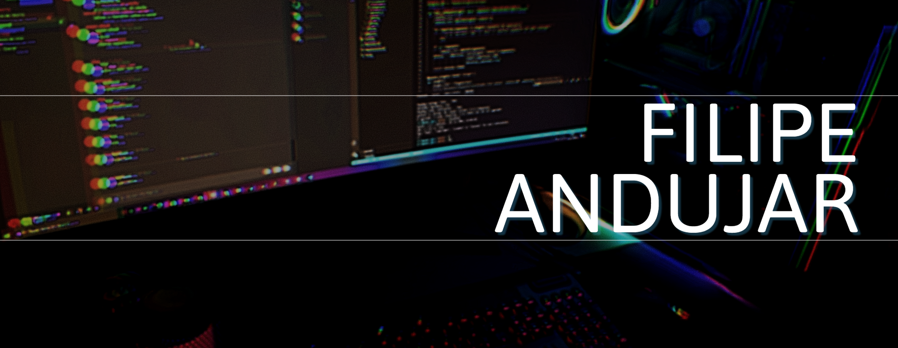

  

## Hi, I'm Filipe Andujar...

I'm a software engineer and a casual gamer. Here are my favorite tools and programming languages:

### Favorite Programming Languages (by the level of Knowledge)
* Python ❤❤❤
* Golang ❤❤❤
* Javascript (NodeJS, React, Typescript) ❤❤

### Cloud Providers (by the level of Knowledge)

* AWS ❤❤❤
* GCP ❤❤❤
* Azure ❤

I have already worked with Oracle Cloud and IBM Cloud but decided to leave them out of my toolkit.

### Tools, Frameworks, and Platforms that I'm focusing on at the moment
* Kubernetes (administration, operators) ❤❤❤
* IaC (terraform, pulumy, crossplane) ❤❤
* A.I. (Generative AI, LLM, Personal assistants) ❤

Feel free to connect with me or [buy me a coffee](https://ko-fi.com/fandujar)
